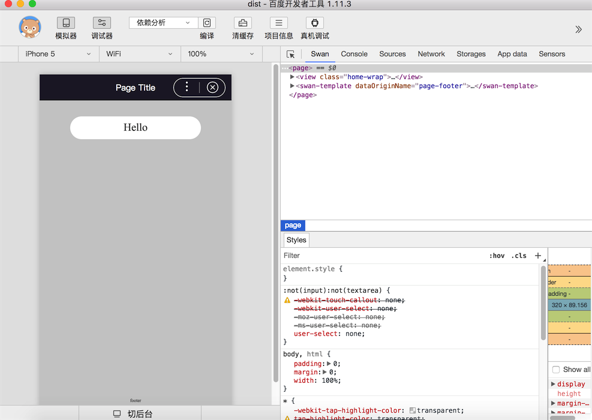

# 快速开始

## 准备工作

* Node 安装（要求 Node >=8 && NPM >= 3）

* 下载项目模板：[okam-template](https://github.com/ecomfe/okam-template)

* 修改项目模板信息为自己小程序项目信息

    * 文件夹名称：`okam-template` 改成自己项目名称

    * 修改 `package.json` 信息: `name`、`description` `author`.

    * 配置小程序 `appid`: `project.json5` 修改 appid 值

    * 项目源码 `src` 可以根据自己项目开发过程中需求，自己再做修改调整

* 目前整个项目模板技术栈是预配置好的，具体可以参考项目模板 `README`，如果有需要调整参考[构建配置](build/index.md)

* 安装依赖：`npm install`

## 运行调试

* 百度小程序运行命令

    * 带 watch 开发模式：`npm run dev`

    * 删掉构建产物（不包括项目配置文件）并重新构建且带 watch 开发模式：`npm run dev:clean`

    * 带 watch && 开发 Server 开发模式：`npm run dev:server`

    * 删掉构建重新构建（没有 watch && 开发 Server）：`npm run build`

    * 生产环境构建：`npm run prod`

* 微信小程序运行命令

    * 微信小程序开发构建：`npm run dev:wx`

    * 微信小程序：删掉构建产物（不包括项目配置文件）并重新构建且带 watch 开发模式：`npm run dev:wx:clean`

    * 带 watch && 开发 Server 开发模式：`npm run dev:wx:server`

    * 微信小程序生产环境构建：`npm run prod:wx`

* 支付宝小程序运行命令

    * 微信小程序开发构建：`npm run dev:ant`

    * 微信小程序：删掉构建产物（不包括项目配置文件）并重新构建且带 watch 开发模式：`npm run dev:ant:clean`

    * 带 watch && 开发 Server 开发模式：`npm run dev:ant:server`

    * 微信小程序生产环境构建：`npm run prod:ant`

* 打开开发工具，打开项目构建目录：`开发工具` -> `打开` -> `<项目Root>/dist`

* 等待开发工具编译，就可以看到预览效果



## 目录结构

目前目录结构规范，没有强制的要求，下面是我们推荐的一种目录结构：

```
.
├── README.md           // 项目说明文件
├── ci.yml              // 项目 CI 配置
├── package.json        // 项目包配置信息
├── doc                 // 放置项目源图片或者其它文档目录
├── dist                // 构建产物目录，开发工具需要选择该目录作为项目根目录方能预览
├── .tinyimgcache       // 自动生成，图片压缩的缓存信息，不可删掉，否则会导致图片重复压缩
├── project.json5       // 小程序项目配置文件，除了语法使用 JS 对象形式，配置说明参考官方小程序说明
├── scripts             // 构建相关脚本
│   ├── build.js        // 构建入口脚本
│   ├── build.sh        // CI 脚本
│   ├── base.config.js  // 基础构建配置文件
│   ├── wx.config.js    // 微信小程序构建配置文件
│   └── swan.config.js  // 百度 Swan 小程序构建配置文件
└── src                 // 项目源码
    ├── app.js          // 小程序入口脚本
    ├── app.styl        // 小程序入口样式
    ├── common          // 项目公共代码
    │   ├── biz         // 项目公共业务代码
    │   ├── css         // 项目公共基础样式
    │   ├── img         // 项目图片资源
    │   └── tpl         // 项目公共模板文件
    ├── components      // 自定义组件
    └── pages           // 小程序页面集合
        ├── home        // 首页
        ├── ...
        └── ...
```

## 开发规范

* App 入口脚本，整体定义基本跟原生保持一致：

    ```javascript
    export default {
        config: { // 同原生的 app.json 定义
            pages: [
                'pages/home/index'
            ],

            window: {
                navigationBarBackgroundColor: '#211E2E',
                navigationBarTextStyle: 'white',
                backgroundTextStyle: 'light',
                enablePullDownRefresh: false,
                backgroundColor: '#ccc'
            },

            networkTimeout: {
                request: 30000
            }
        },

        // 其它定义，同原生 App 定义
        onLaunch() {}
    };
    ```

* 采用单文件组件化方式开发，组件的后缀名默认 `okm`，可以通过构建配置自定义。目前还没有相关的编辑器的语法扩展插件，你可以直接指定组件后缀名为 `Vue`，如果你已经安装了 `Vue` 相关的语法扩展插件，也可以通过文件名后缀自行关联。

* 小程序页面 `Page` 和自定义组件定义方式基本类似，`Page` 本质上也是组件，主要有两点不同

    * Page 没有 `props` 定义

    * 生命周期还有部分事件钩子不同，比如 Page 特有 `onShow` `onHide` 事件钩子，具体可以参考[组件章节](component/component.md)

* 组件定义，定义的属性方法避免使用 `$` 开头，`$` 开头定义的属于框架定义的内部属性、方法

* 注意避免 `data` `props` `computed` 定义的数据字段名称跟挂载到 组件实例上下文的已有方法、属性冲突，由于 `data` `props` `computed` 下的字段名经过框架转换后会被挂载到实例上下文，e.g，`data: {myName: 'xxx'}` 下的 `myName` 会被挂载到实例 `this` 下，即可以通过 `this.myName` 访问到对应的数据

* Page/自定义组件定义

```
<template>
    <view class="home-wrap">
         <view class="home-wrap">
            <button class="hello-btn" @click="onHello">{{computedProp}}</button>
            <view class="click-tip" if="clicked">You click me~</view>
        </view>
    </view>
</template>
<script>
import Hello from '../compoents/Hello';

export default {
    config: { // 同原生小程序配置，部分配置项提供缩略写法，比如 title
        title: 'Page Title'
    },

    props: {}, // 自定义组件支持

    components: { // 引入自定义组件，不需要在 config 里配置
        Hello
    },

    data: {
        btnText: 'Hello',
        clicked: false
    },

    computed: {
        computedProp() {
            return this.btnText + '-suffix';
        }
    },

    /* 生命周期或者其它Page钩子定义 */
    // 生命周期钩子
    created() {},
    mounted() {},
    destroyed() {},

    // Page 显示、隐藏钩子
    onShow() {},
    onHide() {},

    methods: {
        // 事件绑定方法，或者其它方法定义都放在这里
        onHello() {
            this.clicked = true;
            this.btnText = 'yyy'; // 直接赋值即可
        }
    }
};
</script>
<style lang="stylus">
</style>
```

!> Page 和自定义组件上下文还是原生小程序上下文，因此如果想依旧使用原生小程序方式开发，不使用提供的扩展 API 或者数据操作扩展，包括模板语言依旧使用原生的，也是允许的，但建议开发时候保持开发体验一致性。
