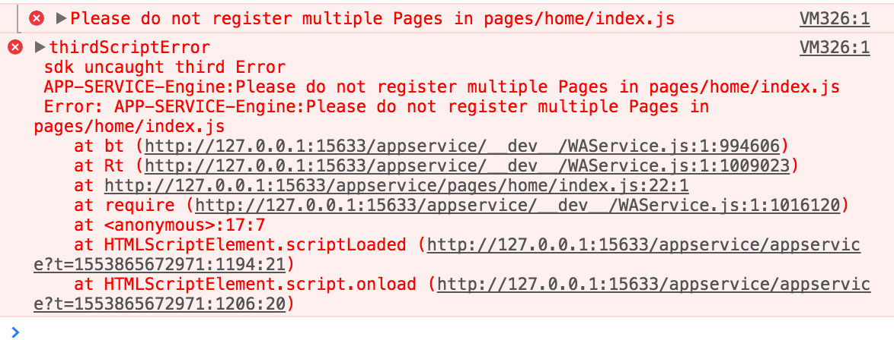
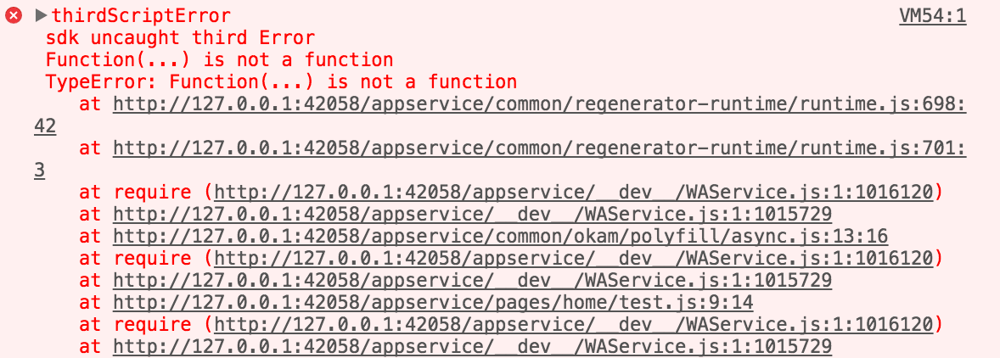

# 问题集锦

!> 这里记录问题，可能随着各个小程序不断迭代升级优化，有些问题可能已被修复。

## Okam 使用问题

* 如果使用了 `Okam` 某个功能不能用，比如 Vue 数据操作方式没有生效，请确保构建配置启用了[相应扩展](/build/index?id=framework)，其次参考使用文档，确认是否自己使用方式不对。


## 微信小程序

* 如果开发工具预览时候报如下类似错误，先看看是否存在引用了某个组件，没有使用。由于目前 `okam` 构建分析一个依赖是否组件，是基于一些关键信息，包括是否在组件配置里声明了 `usingComponents`、 是否使用 `components` 声明了该组件、或者存在单文件组件后缀。如果一个组件，只是简单 `import` 进来，而没有使用，导致 `okam` 构建分析的时候会被当做一个普通的依赖脚本，其同名的模板、样式、配置不会产出到构建产物里，就会报如下错误。

    ```javascript
    // 在页面脚本里导入了原生组件，但没有使用，就会报如下截图错误
    import VanCard from 'vant-weapp/dist/card/index';
    export default {
        config: {title: 'Home'},
        data: {}
    };
    ```

    

* 如果小程序里开启 `async await` 语法支持，但在开发工具里报了如下错误。请确认你安装的 `polyfill` 依赖 `regnerator-runtime` 版本是否是 `0.13.2` 以上，如果是，请把依赖改成 `0.13.1` 版本。由于在最新版里加入了个全局变量挂载的逻辑，用于挂载 `regnerator-runtime` 全局变量，但要求不能在严格模式下，由于微信开发者工具一般转出来的代码会加上 `use strict` 变成严格模式，除非你关闭 `es6` 代码转换。

    

## 支付宝小程序

* 目前支付宝开发者工具是默认支持 `ES6` 语法，但部分语法支持有点问题

    模块 a 定义：
    ```javascript
    // ./a.js
    import * as abc from 'xxx';
    export default abc; // 这种写法会导致默认导出没有成功
    // export {abc as default}; // 这样也是没法导出成功
    // export default Object.assign{{}, abc}; // 这样是 ok 的
    // export {abc}; // 不使用默认导出，这样是 ok 的
    ```

    模块 b 导入模块 a 定义：
    ```javascript
    // ./b.js
    import abc from 'a';
    // abc undefined
    ```

* 如果脚本文件内容是空的，会导致开发者工具报错

* 开发者工具有时候点击左上角返回上一级页面会报：`Cannot read property 'NBPageUrl' of undefined` ：具体原因不详，可以把开发者工具生成的 `.tea` 目录（构建出来项目目录下）删掉，退出开发者工具再进入，自己就会好了。

* 构建配置 `localPolyfill` 引入 `promise` 会导致 `IOS` 下预览出错，目前所有小程序都是默认支持 `Promise`，因此不再需要做 `promise` `polyfill`，解决办法删掉该 `promise` 配置项即可修复，具体原因不详。

* 不支持 `icon` 上绑事件

## 百度小程序

* 自定义组件中的图片路径是相对于引用页面的，这是实现问题，最新版本会在 `2019.2` [修复上线](https://smartprogram.baidu.com/forum/topic/show/65546)。因此对于此情况，想多平台生效，可以将路径设置为 相对于 小程序项目目录的 绝对路径，如: `'/common/img/x.png'`, 具体路径，视自己项目情况而定。

* 百度小程序非兼容性升级关注
    * [2018.11.23](https://smartprogram.baidu.com/forum/topic/show/64420)
    * [2019.01.17](https://smartprogram.baidu.com/forum/topic/show/65546)

* 字体图标 真机ios正常，安卓不正常

## 头条小程序

* `input` 原生组件 `maxlength`，不支持 -1 为无限制

* 自定义组件上挂的 `data-` 取不到

* 自定义事件 值只能是对象类型

* 自定义组件内 监听 `capture` 事件 会执行两遍, 一遍 `page` 上的同名函数，一遍 `component` 上的函数
